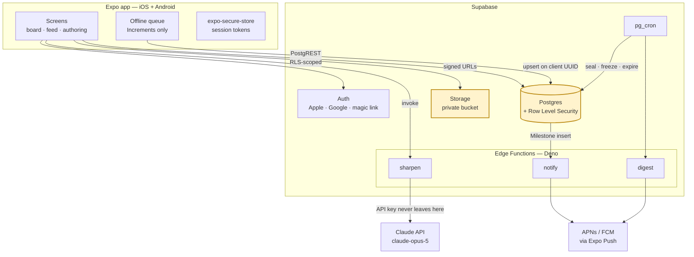
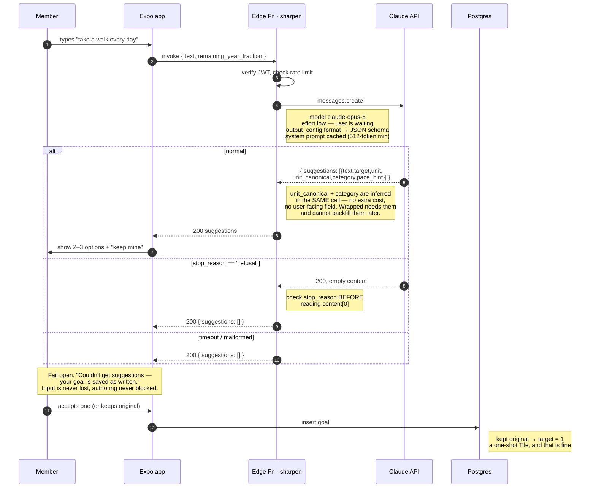
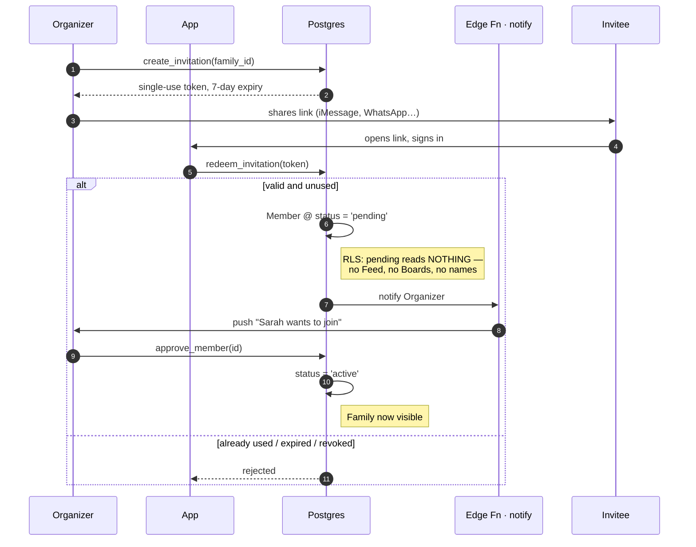
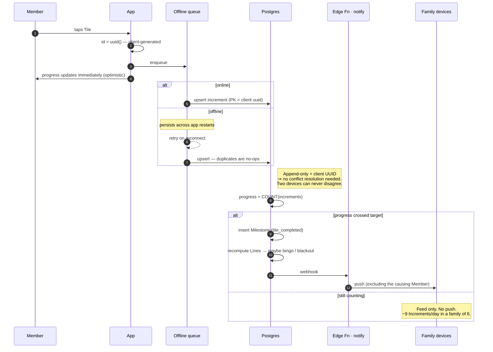
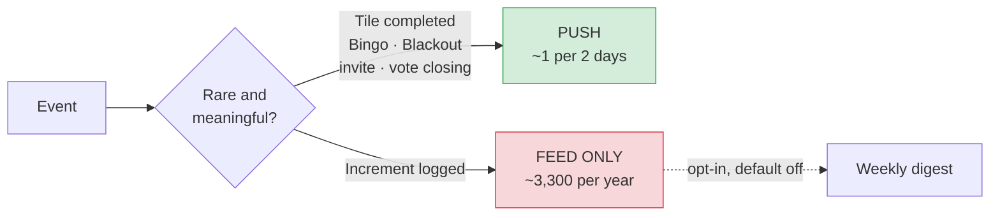

# Family Bingo — API Surface

Terms: [`../CONTEXT.md`](../CONTEXT.md) · Requirements: [`prd.md`](prd.md) · Data: [`schema.md`](schema.md)

---

## 1. Architecture



**The two boxes in amber are the security boundary.** Postgres RLS and Storage policies
are what keep one Family's data — including photographs of children — away from every
other Family. Everything else is plumbing.

---

## 2. Surface map

| Concern | Mechanism | Why |
|---|---|---|
| Read Boards, Tiles, Feed, Members | **PostgREST**, RLS-scoped | No endpoint to write; RLS is the authorization |
| Log an Increment | **PostgREST** upsert on client UUID | Idempotent by construction — makes the offline queue safe |
| Multi-step writes (create Family, open Year, seal, Swap) | **Postgres RPC** (`SECURITY INVOKER`) | Atomic and RLS-respecting |
| Sharpening | **Edge Function** | The Claude API key cannot ship in a mobile app |
| Push fan-out | **Edge Function** on Milestone insert | Needs Expo Push credentials |
| Seal, freeze, expire, digest | **`pg_cron`** | Time-driven, no client involved |
| Photos | **Storage** + short-TTL signed URLs | Private bucket, Family-scoped path |

> **`SECURITY INVOKER`, not `DEFINER`.** RPCs run as the caller so RLS still applies.
> The one deliberate exception is `visible_family_ids()` (schema.md §4.1), which must be
> `SECURITY DEFINER` to read `members` while evaluating a policy *on* `members`.

### 2.0 The `feed` view

The Feed is a `security_invoker` view, not an endpoint and not an RPC. It has **no policy
of its own**: every row is filtered by the read policy of the table it came from, so the
Family boundary is stated once (ADR-0004) rather than restated on the one surface that
reads from every table at once.

Clients page it through PostgREST: `?family_id=eq.…&year_id=eq.…&order=created_at.desc&limit=…`.

| `kind` | Source | Columns that mean something |
|---|---|---|
| `increment` | `increments` | `note`, `attachment_path`, `tile_id`, `position`, `goal_text` |
| `milestone` | `milestones` | `milestone_type`, `line_index`, `tile_id`, `position`, `goal_text` |
| `swap` | `revisions` | `before_text`, `before_target`, `after_text`, `after_target` |
| `vote_resolved` | `votes` | `vote_kind`, `vote_outcome`, `goal_text` (the winning Proposal) |
| `member_joined` | `members` | `member_id` |

Every row carries `id`, `kind`, `created_at`, `family_id`, `year_id`, `member_id`.
`member_id` is null for `vote_resolved` — a Vote is the Family's, not a Member's.

A Member joins a Family rather than a Year, so `member_joined` is attributed to the Year
that was open when they joined; a founder, who joined before `open_year()` could be
called, lands in the Family's first Year.

### 2.1 RPCs

| Function | Does | Guard |
|---|---|---|
| `create_family(name, timezone)` | Family + Organizer Member, one transaction | Authenticated |
| `create_invitation(family_id)` | Single-use token, 7-day expiry | Organizer only |
| `redeem_invitation(token)` | Member at `status = 'pending'` | Valid, unused, unexpired |
| `approve_member(member_id)` | `pending → active` | Organizer only |
| `create_managed_member(family_id, name)` | Member with `guardian_account_id` | Active adult Member |
| `open_year(family_id, calendar_year)` | Year + Boards + 25 Tiles each + both Votes | Organizer, no Year exists |
| `write_goal(tile_id, text, target, …)` | Authors or edits a Tile's Goal | Own Board, draft — plus the one §9.5 write |
| `clear_goal(tile_id)` | Empties a Tile | Own Board, draft |
| `cast_ballot(vote_id, member_id, choice_mode, proposal_id)` | Upsert Ballot | Controlled Member, Vote open |
| `set_organizer_tiebreak(vote_id, proposal_id)` | Names the Organizer's pick among tied leaders (ADR-0007) | Organizer only |
| `resolve_center_vote(year_id)` | Resolves both Votes, applies §8.3 / §9.3 fallbacks | `pg_cron` or Organizer, Setup Window closed |
| `seal_year(year_id)` | Resolves the Center Vote, then seals every Board, Year → `active` | `pg_cron` or Organizer, idempotent |
| `seal_due_boards()` | The sweep: every Year past its deadline, then §21.1 stragglers | `pg_cron` |
| `complete_family_goal(year_id, member_id)` | Marks the Family Goal done, completing Tile 12 for every Member at once (§12.3) | Controlled Member of that Family, Year not frozen, idempotent |
| `swap_tile(tile_id, text, target)` | Revision + `swaps_used += 1` | Sealed Board, budget remaining |
| `freeze_year(year_id)` | Year → `frozen` | `pg_cron`, idempotent |
| `generate_wrapped(year_id)` | Materializes cards + Awards, one per Year | `pg_cron` after freeze, idempotent |

### 2.2 Edge Functions

| Function | Trigger | Notes |
|---|---|---|
| `sharpen` | Client invoke | Claude call. Rate-limited 100/Member/Year |
| `notify` | DB webhook on `milestones` insert | Never notifies the causing Member |
| `digest` | `pg_cron` weekly | Opt-in only; skipped if the week was empty |

---

## 3. Sharpening

The one place the app talks to a model. Note the two failure paths — both keep the
Member's text.



**§7.5 restated, because it is the requirement most likely to be "improved" away:**
Sharpening advises. It never validates, never rejects, never tells someone their goal
isn't good enough. The canonical input is *"Be a better father"* — an app that refuses
that is an app someone deletes.

---

## 4. Invitation and approval

Two gates, because invite links get forwarded into group chats.



| Attack | Stopped by |
|---|---|
| Link forwarded **after** first use | Single-use |
| Link forwarded **before** first use | Organizer approval |
| Link found later | 7-day expiry |
| Wrong person already inside | Organizer can remove |

Both gates are needed. Neither covers the other's case.

---

## 5. Logging an Increment, online and offline



**Why the offline scope is narrow.** Increments are append-only, so an offline queue
needs no merge semantics at all — the UUID upsert *is* the whole conflict story. Boards
and votes do not have that property, which is why they stay online-only. Do not extend
the queue to them without solving merges first.

---

## 6. Notification tiering



| Event | Frequency (family of 6) | As push |
|---|---|---|
| Increment | ~3,300/yr | **Unusable** — feed only |
| Tile completed | 144/yr | ~1 per 2.5 days ✅ |
| Bingo | ~12/yr | An event ✅ |
| Blackout | 0–2/yr | Everyone should hear ✅ |

Notification permission is a **one-way door**: once someone disables it at the OS level,
the app cannot win them back. Do not spend it on `+1 walk`.

---

## 7. Year lifecycle jobs

```mermaid
sequenceDiagram
    autonumber
    participant Cron as pg_cron
    participant DB as Postgres
    participant N as notify

    Note over Cron,DB: — Setup Window closes —
    Cron->>DB: seal_due_boards()
    DB->>DB: seal_year(year), per Year past its deadline
    DB->>DB: resolve_center_vote(year)
    Note right of DB: mode: majority of Ballots CAST.<br/>tie or zero → personal.<br/>Silence never blocks.
    alt shared won
        Note right of DB: goal: plurality; tie → Organizer.<br/>zero Proposals → personal.
        DB->>DB: family_goal_id → every Tile 12
    end
    DB->>DB: sealed_at → every Board, Year → active
    Note right of DB: seals whether or not authoring<br/>finished. Empty Tiles cost a Swap later —<br/>except a personal Tile 12, free for 7 days (§9.5).
    DB->>N: "your board is sealed"

    Note over Cron,DB: — Dec 31, 23:59 in Family timezone —
    Cron->>DB: freeze_year()
    Note right of DB: read-only forever. No backdating.
    Cron->>DB: generate_wrapped(year_id)
    Note right of DB: materialized once — inputs are frozen,<br/>so they can never change again.<br/>Awards assigned across unrelated axes,<br/>every Member guaranteed at least one.
    DB->>N: push ALL Members simultaneously
    N->>N: "Your 2027 Wrapped is ready"
    Note over Cron,DB: final card links into opening Year 2028
```

Every job is **idempotent** and safe to re-run — they are time-triggered, and a retry
after a partial failure must not double-apply.

---

## 8. Client data access

```ts
// Reads: PostgREST. No endpoint, no server code — RLS is the authorization.
const { data: board } = await supabase
  .from('boards')
  .select('*, tiles(*, goals(*), increments(count))')
  .eq('year_id', yearId)
  .eq('member_id', memberId)
  .single();

// Writes: upsert on the client-generated UUID. Safe to retry forever.
await supabase.from('increments').upsert(
  { id: crypto.randomUUID(), tile_id, member_id, note },
  { onConflict: 'id', ignoreDuplicates: true },
);

// Multi-step writes: RPC, atomic, SECURITY INVOKER so RLS still applies.
await supabase.rpc('swap_tile', { tile_id, text, target });

// Photos: private bucket, short-TTL signed URL. Never a public URL.
const { data } = await supabase.storage
  .from('attachments')
  .createSignedUrl(`${familyId}/${incrementId}.jpg`, 3600);
```

**There is no REST API to write.** That is the point of choosing Supabase
([ADR-0004](adr/0004-supabase-rls-boundary.md)): the authorization lives in the
database, so a forgotten `WHERE` clause in client code cannot leak another Family's
photographs.

---

## 9. Errors

| Case | Response | Client behavior |
|---|---|---|
| RLS denies | Empty result (**not** an error) | Render empty state — never "access denied" |
| Sharpening fails or refuses | `200 { suggestions: [] }` | Keep the Member's text, say suggestions were unavailable |
| Increment while offline | Queued | Optimistic UI; sync later |
| Duplicate Increment | Upsert no-op | Invisible to the user |
| Swap with 0 budget | `403` | "You've used all 3 Swaps this year" |
| Edit a sealed Tile | `403` | Offer a Swap instead |
| Expired Invitation | `410` | "This invitation has expired — ask for a new one" |

**RLS denial returns zero rows, not a 403.** That is intentional: a 403 confirms the
resource exists. Zero rows tells an outsider nothing.
