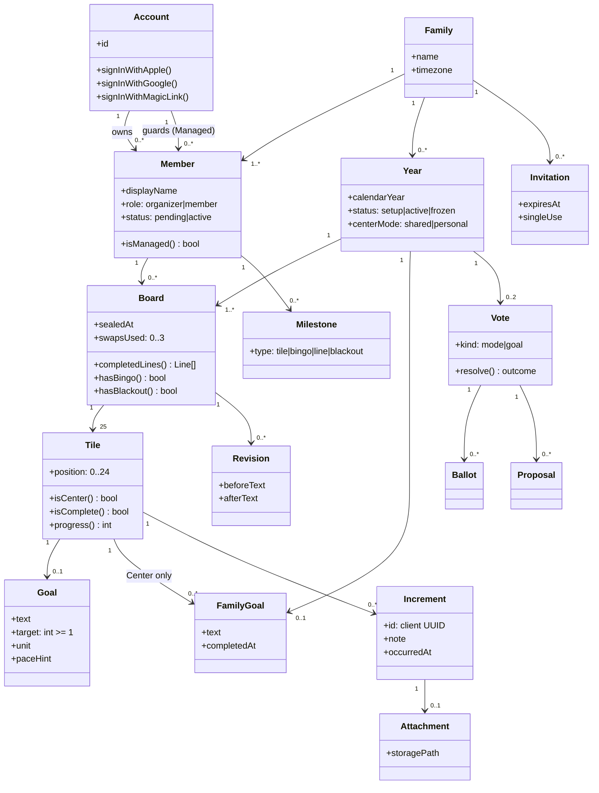
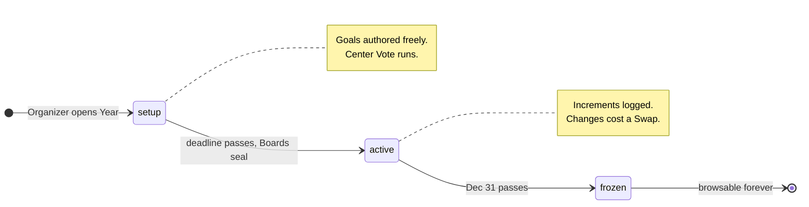
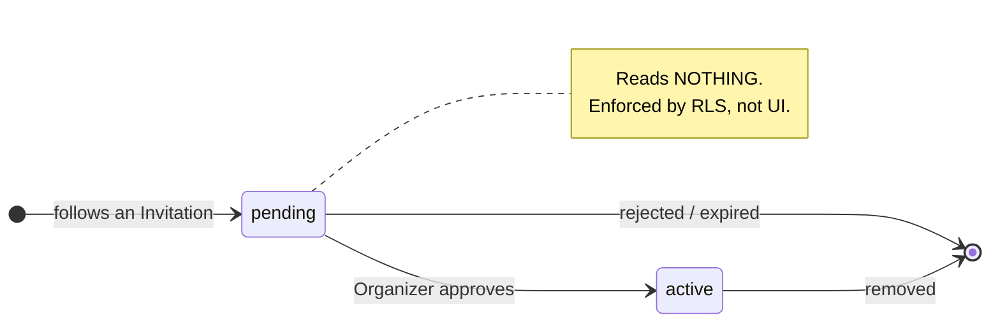

# Family Bingo — Data Model

Terms are defined in [`../CONTEXT.md`](../CONTEXT.md). Requirements are in
[`prd.md`](prd.md). This document is the structure those two imply.

---

## 1. Domain model

The conceptual shape, before persistence concerns.



**Three relationships carry the whole design.** Everything else follows from them:

| Relationship | Why it matters |
|---|---|
| `Account → Member` is **one-to-many** | A Guardian drives several Members. Kills the assumption that "logged-in user" == "player" ([ADR-0003](adr/0003-managed-child-profiles.md)) |
| `Board → Member`, **not** `Board → Account` | Two Families means two Boards. Nothing crosses a Family boundary ([ADR-0001](adr/0001-personal-boards.md)) |
| `Tile → FamilyGoal` on the Center only | One shared row referenced by every Board, so completing it completes for everyone at once |

---

## 2. Entity–relationship diagram

```mermaid
erDiagram
    accounts ||--o{ members : "owns"
    accounts ||--o{ members : "guards"
    accounts ||--o{ device_tokens : ""
    families ||--|{ members : ""
    families ||--o{ years : ""
    families ||--o{ invitations : ""
    members ||--o{ boards : ""
    members ||--o{ increments : "logs"
    members ||--o{ milestones : "earns"
    members ||--o{ ballots : "casts"
    members ||--o{ proposals : "submits"
    years ||--|{ boards : ""
    years ||--o| family_goals : ""
    years ||--o{ votes : ""
    years ||--o| wrapped : "at Freeze"
    wrapped ||--|{ wrapped_member_cards : ""
    wrapped ||--|{ wrapped_awards : ""
    members ||--o{ wrapped_awards : "receives >= 1"
    boards ||--|{ tiles : "exactly 25"
    boards ||--o{ revisions : ""
    tiles ||--o| goals : ""
    tiles ||--o{ increments : ""
    family_goals ||--o{ tiles : "Center Tile"
    increments ||--o| attachments : ""
    votes ||--o{ ballots : ""
    votes ||--o{ proposals : ""
    proposals ||--o{ ballots : "chosen by"

    accounts {
        uuid id PK
        text email
        timestamptz created_at
        timestamptz deleted_at
    }
    families {
        uuid id PK
        text name
        text timezone
        timestamptz created_at
    }
    members {
        uuid id PK
        uuid family_id FK
        uuid account_id FK "null when Managed"
        uuid guardian_account_id FK "null when self"
        text display_name
        text avatar_url
        text role "organizer|member"
        text status "pending|active"
        bool digest_opt_in
        timestamptz joined_at
    }
    invitations {
        uuid id PK
        uuid family_id FK
        text token_hash
        uuid created_by_member_id FK
        timestamptz expires_at
        timestamptz used_at
        timestamptz revoked_at
    }
    years {
        uuid id PK
        uuid family_id FK
        int calendar_year
        text status "setup|active|frozen"
        text center_mode "shared|personal|undecided"
        timestamptz setup_deadline
        timestamptz sealed_at
        timestamptz frozen_at
    }
    family_goals {
        uuid id PK
        uuid year_id FK
        text text
        timestamptz completed_at
        uuid completed_by_member_id FK
    }
    boards {
        uuid id PK
        uuid member_id FK
        uuid year_id FK
        timestamptz sealed_at
        int swaps_used
        timestamptz joined_late_at
        timestamptz personal_setup_deadline
    }
    tiles {
        uuid id PK
        uuid board_id FK
        int position "0..24"
        uuid goal_id FK "personal"
        uuid family_goal_id FK "Center only"
    }
    goals {
        uuid id PK
        text text
        int target "">= 1""
        text unit "Member's wording"
        text unit_canonical "singular lowercase"
        text category "inferred"
        text pace_hint "display only"
        timestamptz created_at
    }
    wrapped {
        uuid id PK
        uuid year_id FK "unique"
        jsonb family_cards
        timestamptz generated_at
    }
    wrapped_member_cards {
        uuid id PK
        uuid wrapped_id FK
        uuid member_id FK
        jsonb stats
    }
    wrapped_awards {
        uuid id PK
        uuid wrapped_id FK
        uuid member_id FK
        text axis
        text label
        jsonb detail
    }
    increments {
        uuid id PK "client-generated"
        uuid tile_id FK
        uuid member_id FK
        text note
        timestamptz occurred_at
        timestamptz created_at
    }
    attachments {
        uuid id PK
        uuid increment_id FK "unique"
        text storage_path
        int width
        int height
        int bytes
    }
    milestones {
        uuid id PK
        uuid member_id FK
        uuid year_id FK
        text type "tile|bingo|line|blackout"
        uuid tile_id FK
        int line_index "0..11"
        timestamptz created_at
    }
    revisions {
        uuid id PK
        uuid board_id FK
        uuid tile_id FK
        text before_text
        int before_target
        text after_text
        int after_target
        timestamptz created_at
    }
    votes {
        uuid id PK
        uuid year_id FK
        text kind "mode|goal"
        text status "open|resolved"
        text outcome
        uuid organizer_tiebreak_proposal_id FK "ADR-0007"
        timestamptz closes_at
        timestamptz resolved_at
    }
    proposals {
        uuid id PK
        uuid vote_id FK
        uuid member_id FK
        text text
    }
    ballots {
        uuid id PK
        uuid vote_id FK
        uuid member_id FK
        text choice_mode "shared|personal"
        uuid proposal_id FK
        timestamptz updated_at
    }
    device_tokens {
        uuid id PK
        uuid account_id FK
        text token
        text platform "ios|android"
        timestamptz last_seen_at
    }
```

---

## 3. Constraints that enforce the invariants

Encode these in the schema. A rule that lives only in application code is a rule that
will eventually be violated by a background job, a migration, or an agent.

```sql
-- A Member is EITHER a real Account OR guarded by one. Never both, never neither.
ALTER TABLE members ADD CONSTRAINT member_has_exactly_one_backer
  CHECK (num_nonnulls(account_id, guardian_account_id) = 1);

-- One Board per Member per Year.
ALTER TABLE boards ADD CONSTRAINT one_board_per_member_per_year
  UNIQUE (member_id, year_id);

-- Exactly 25 Tiles, positions 0-24, no duplicates.
ALTER TABLE tiles ADD CONSTRAINT tile_position_range
  CHECK (position BETWEEN 0 AND 24);
ALTER TABLE tiles ADD CONSTRAINT one_tile_per_position
  UNIQUE (board_id, position);

-- A Tile holds at most one kind of Goal. Both null is legal (unfilled draft).
ALTER TABLE tiles ADD CONSTRAINT tile_goal_source_exclusive
  CHECK (num_nonnulls(goal_id, family_goal_id) <= 1);

-- Only the Center Tile may hold a Family Goal.
ALTER TABLE tiles ADD CONSTRAINT family_goal_is_center_only
  CHECK (family_goal_id IS NULL OR position = 12);

-- Targets are always achievable. target = 1 IS the one-shot shape.
ALTER TABLE goals ADD CONSTRAINT target_positive
  CHECK (target >= 1);

-- Three Swaps per Board per Year, enforced in the database.
ALTER TABLE boards ADD CONSTRAINT swap_budget
  CHECK (swaps_used BETWEEN 0 AND 3);

-- One Ballot per Member per Vote. Changing a vote is an UPDATE, not a second row.
ALTER TABLE ballots ADD CONSTRAINT one_ballot_per_member
  UNIQUE (vote_id, member_id);

-- One Attachment per Increment.
ALTER TABLE attachments ADD CONSTRAINT one_attachment_per_increment
  UNIQUE (increment_id);

-- One Year per Family per calendar year.
ALTER TABLE years ADD CONSTRAINT one_year_per_family
  UNIQUE (family_id, calendar_year);

-- A Line index refers to one of the 12 enumerated Lines.
ALTER TABLE milestones ADD CONSTRAINT line_index_range
  CHECK (line_index IS NULL OR line_index BETWEEN 0 AND 11);

-- Category is a closed set. Null is legal: a Goal that skipped Sharpening.
ALTER TABLE goals ADD CONSTRAINT category_known
  CHECK (category IS NULL OR category IN
    ('fitness','family','learning','money','health','creative','other'));

-- One Wrapped per Year, generated once at Freeze.
ALTER TABLE wrapped ADD CONSTRAINT one_wrapped_per_year
  UNIQUE (year_id);

-- A Member wins a given axis at most once.
ALTER TABLE wrapped_awards ADD CONSTRAINT one_award_per_axis_per_member
  UNIQUE (wrapped_id, member_id, axis);
```

> **"Every Member gets at least one Award" is not expressible as a constraint** — it is a
> property of the generation algorithm, across rows that do not yet exist at insert time.
> It must be enforced by the generator and verified by a test (PRD §20.7). A family of six
> with one low-activity Member is the case that breaks a naive implementation.

### 3.1 What is deliberately *not* stored

| Not stored | Derived from | Why |
|---|---|---|
| Tile completion flag | `COUNT(increments) >= goals.target` | A cached flag and an append-only log will drift; the log wins |
| Progress counter | `COUNT(increments)` | Same reason. Index `increments(tile_id)` instead |
| Completed Lines | Pure function of completed positions | Testable in isolation, no sync risk |
| Bingo / Blackout state | Presence of a Milestone row | The Milestone is the event; state is its consequence |

**Two deliberate exceptions.**

`boards.swaps_used` duplicates `COUNT(revisions)`. It is stored because it is a **budget
being enforced**, and a `CHECK` constraint cannot reference another table. Keep it
correct with a trigger on `revisions` insert.

The `wrapped*` tables **materialize** statistics that could be computed from the log.
That is deliberate and safe here for a reason that does not apply anywhere else: the
underlying Year is **frozen**, so the inputs can never change again. Wrapped is written
once at Freeze and read many times, and it must render instantly. Everywhere the source
data is still mutable, derive it.

---

## 4. Row Level Security

RLS is the enforcement mechanism for §8.1 of the PRD, not a second layer behind
application checks ([ADR-0004](adr/0004-supabase-rls-boundary.md)).

### 4.1 The helper every policy builds on

```sql
-- Families the caller can see: those where they are an ACTIVE Member,
-- either directly or as a Guardian.
CREATE OR REPLACE FUNCTION visible_family_ids()
RETURNS SETOF uuid
LANGUAGE sql STABLE SECURITY DEFINER
SET search_path = public
AS $$
  SELECT family_id FROM members
  WHERE status = 'active'
    AND (account_id = auth.uid() OR guardian_account_id = auth.uid());
$$;
```

`status = 'active'` is doing real work here: it is what makes a `pending` Member unable
to read anything (PRD §3.2). Do not relax it.

### 4.2 Policy shape

Every Family-scoped table follows this pattern, reaching the Family through whatever
joins it needs:

```sql
ALTER TABLE increments ENABLE ROW LEVEL SECURITY;

CREATE POLICY increments_family_read ON increments FOR SELECT
USING (
  (SELECT b.member_id FROM tiles t
     JOIN boards b ON b.id = t.board_id
    WHERE t.id = increments.tile_id) IN (
      SELECT id FROM members WHERE family_id IN (SELECT visible_family_ids())
  )
);

-- Writes are narrower than reads: you may log only for a Member you control.
CREATE POLICY increments_own_write ON increments FOR INSERT
WITH CHECK (
  member_id IN (
    SELECT id FROM members
     WHERE status = 'active'
       AND (account_id = auth.uid() OR guardian_account_id = auth.uid())
  )
);
```

**Reads are Family-wide; writes are self-only.** You can see everything your Family
does and change only what is yours (or your Managed Members').

The real `increments` insert policy carries two more conditions the sketch above leaves
out. The Tile must belong to the Board of the Member being credited — without that, a
Guardian could log against someone else's Tile while attributing it to their own child.
And `tile_is_loggable()` must hold: the Board is sealed, the Year is not frozen, and the
Tile holds a personal Goal. That last clause rules out both the empty Tile and the
shared Center Tile, which have no Target between them — see PRD §12.1 and §12.3.

**Increment timestamps are not the client's to choose.** `created_at` is overwritten
with the server clock on insert, because the Feed is ordered by it. `occurred_at` stays
client-settable — the offline queue replays taps days after they happened (PRD §17.3),
which is why the column exists at all — but it is bounded to `[sealed_at, now()]`, and
the two ends are not treated alike:

| Claim | Response | Why |
|---|---|---|
| `occurred_at` in the future | Pulled back to `now()`, tap kept | A device clock running fast. Benign, and nothing the Member could act on if told — while refusing it loses a real tap the offline queue will retry forever (§17.2) |
| `occurred_at` before the seal | Refused, `PT403` | No queue can hold a tap from before the Board existed, so this is a client bug or the backdating §11.5 names. Wrapped aggregates by month and hands out "biggest month" and "most consistent" (§20.4) — an unbounded `occurred_at` writes those Awards |

The lower bound is `least(sealed_at, now())` rather than `sealed_at` outright, so that a
Board somehow stamped ahead of the clock cannot refuse every possible tap.

### 4.3 Storage

Attachments live in a **private** bucket with the Family id as the first path segment:

```
attachments/{family_id}/{increment_id}.jpg
```

The Storage policy checks `(storage.foldername(name))[1]::uuid IN (SELECT visible_family_ids())`.
Clients receive **short-TTL signed URLs** — never a public URL, never a guessable path.

### 4.4 Required negative tests

For every table above, a pgTAP test must assert that an Account in a **different**
Family gets **zero rows** — not an error, zero rows. Plus, for Storage, that a direct
object URL fails both unauthenticated and cross-Family (PRD §16.5).

This is the highest-consequence test in the suite. The payload is photographs of
children.

---

## 5. The twelve Lines

Positions are **row-major, 0-indexed**: position `p` is at row `p / 5`, column `p % 5`.
Enumerate the Lines as constants — do not compute them at runtime.

```
 0  1  2  3  4
 5  6  7  8  9
10 11 12 13 14      ← 12 is the Center Tile
15 16 17 18 19
20 21 22 23 24
```

| # | Line | Positions |
|---|---|---|
| 0–4 | Rows | `[0-4] [5-9] [10-14] [15-19] [20-24]` |
| 5–9 | Columns | `[0,5,10,15,20]` … `[4,9,14,19,24]` |
| 10 | Diagonal ↘ | `[0,6,12,18,24]` |
| 11 | Diagonal ↙ | `[4,8,12,16,20]` |

**The Center Tile sits on 4 of the 12 Lines** (row 2, column 2, both diagonals). When
the Family completes a shared Family Goal, every Member's Board advances on four Lines
at the same moment — which is the point of the shared centre.

```ts
export const LINES: readonly (readonly number[])[] = [
  [0,1,2,3,4], [5,6,7,8,9], [10,11,12,13,14], [15,16,17,18,19], [20,21,22,23,24],
  [0,5,10,15,20], [1,6,11,16,21], [2,7,12,17,22], [3,8,13,18,23], [4,9,14,19,24],
  [0,6,12,18,24], [4,8,12,16,20],
];

/** Pure. Unit-test exhaustively before it touches the database. */
export const completedLines = (done: ReadonlySet<number>): number[] =>
  LINES.flatMap((line, i) => line.every(p => done.has(p)) ? [i] : []);
```

**There are two copies of this table and there have to be.** The client renders the
12-segment pip row from `LINES` in `src/domain/lines.ts`; the database records against
`board_lines()`, because a Bingo is a social claim and the only writer of `milestones`
is Postgres reacting to a log it can verify. `milestones.line_index` refers to the order
above, so the two must agree — `supabase/tests/lines.test.sql` asserts the SQL copy
position by position, and that is the only thing holding them together.

---

## 6. Lifecycles





---

## 7. Indexes

```sql
CREATE INDEX ON members (family_id, status);
CREATE INDEX ON members (account_id) WHERE account_id IS NOT NULL;
CREATE INDEX ON members (guardian_account_id) WHERE guardian_account_id IS NOT NULL;
CREATE INDEX ON boards (year_id);
CREATE INDEX ON tiles (board_id, position);
CREATE INDEX ON increments (tile_id);              -- progress counts
CREATE INDEX ON increments (member_id, created_at DESC);  -- the Feed
CREATE INDEX ON milestones (year_id, created_at DESC);    -- the Feed
CREATE INDEX ON invitations (token_hash) WHERE used_at IS NULL AND revoked_at IS NULL;
```

`increments(tile_id)` is the one that matters most — it backs every progress count in
the app, and progress is deliberately not denormalized (§3.1).
